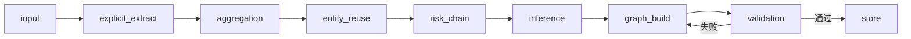

# 消融实验方法论文档

> 生成日期：2026-07-22
> 数据集：100-event gold-standard evaluation set (`data/gold_standard_100_events.json`)
> 管道入口：`src/agent/graph.py` → `compile_pipeline()`
> 代码版本：`7d98ea3`

---

## 目录

1. [实验设计概述](#1-实验设计概述)
2. [五个实验变体的定义](#2-五个实验变体的定义)
3. [数据集与运行环境](#3-数据集与运行环境)
4. [评测指标定义](#4-评测指标定义)
   - 4.1 基于人工仲裁的指标（F1/Acc）
   - 4.2 自动计算的指标（GDC/KDC/RCC/TDV）
5. [完整结果表](#5-完整结果表)
6. [每变体详细分析](#6-每变体详细分析)
7. [代码架构与重现步骤](#7-代码架构与重现步骤)
8. [指标的有效性论证](#8-指标的有效性论证)

---

## 1. 实验设计概述

消融实验的目的是验证 OntoRisk 管线中每个核心模块的独立贡献。

### 实验变体

| 变体 ID | 论文行 | 移除模块 |
|---|---|---|
| `full_ontorisk` | Full OntoRisk (Ours) | 无（完整管线） |
| `ablation_no_ontology` | w/o Ontology Constraint | 本体约束 → explicit_extract 不受类型限制，validation 跳过类型校验 |
| `ablation_no_event_aggregation` | w/o Event Aggregation | 每文档独立抽取，事件级做简单并集 |
| `ablation_no_evidence_constraint` | w/o Evidence Constraint | 证据约束 → prompt 不需给出 evidence/source，validation 跳过检查 |
| `ablation_no_controlled_inference` | w/o Controlled Inference | 受控推理 → 不使用本体候选限制，自由推理 |

### 管线结构（完整版）

```
input → explicit_extract → aggregation → entity_reuse → risk_chain → inference → graph_build → validation → store
       ↑ Stage 1-2          ↑ Stage 3     ↑ Stage 4 L1    ↑ Stage 4 L2  ↑ Stage 4 L3  ↑ Stage 5
```

每个变体通过 `experiment` 参数字典中的开关控制行为，各开关定义在 `src/experiments/flags.py`：

```python
VARIANT_FLAGS = {
    "full": {},
    "no_ontology": {"disable_ontology_constraint": True},
    "no_agg": {"disable_event_aggregation": True},
    "no_evidence": {"disable_evidence_constraint": True},
    "no_inference": {"disable_controlled_inference": True},
}
```

### 变体实现细节

#### w/o Ontology Constraint (`disable_ontology_constraint: True`)

- **Stage 2** (`src/agent/nodes/explicit_extract.py` 第145-149行)：在 prompt 中加入放宽提示，允许使用任何 AIRO 兼容类型，不限制 `_STAGE2_TYPES` 集合
- **Stage 4 L3** (`src/agent/nodes/inference.py` 第149行)：使用 `FREE_INFERENCE_*_PROMPT`，不限制候选值
- **Validation** (`src/agent/nodes/validation.py` 第35行)：跳过 relation domain/range 校验

#### w/o Event Aggregation (`disable_event_aggregation: True`)

- 在 `run_ablation_variant` 中为每文档独立运行完整 pipeline（包括 Stage 2/4/5），然后在事件级做简单并集
- 不做：EntityNorm、SupportCount、ConflictDetect、语义对齐、LLM 验证
- 实现在 `src/experiments/ablation.py` 第196-226行的 `run_ablation_variant("no_agg")` 分支

#### w/o Evidence Constraint (`disable_evidence_constraint: True`)

- **Stage 2** prompt：evidence_sentence 标注为 OPTIONAL
- **Stage 4 L2/L3** prompt：证据、source_doc_id、reasoning 可选
- **Validation**：跳过 evidence 非空校验、source_doc_id 合法性校验、inferred reasoning 校验

#### w/o Controlled Inference (`disable_controlled_inference: True`)

- **Stage 4 L3**：使用 `FREE_INFERENCE_*_PROMPT`（自由推理 prompt）
  - 同一份 evidence 输入
  - 同一份 JSON 输出格式
  - 唯一差别：没有固定候选值限制

---

## 2. 五个实验变体的定义

### 2.1 Full OntoRisk

完整系统，不做改动。入口：

```bash
python main.py batch --all
```

图流程定义见 `src/agent/graph.py`，每个节点按顺序执行：



### 2.2 w/o Ontology Constraint

移除三类本体约束：

1. **Stage 2** 不再强制限制抽取类型集合（`_STAGE2_TYPES` 放宽）
2. **Stage 4 L3** 不再限制推理候选空间（使用自由推理 prompt）
3. **Validation** 不再进行 ontology domain/range 校验

### 2.3 w/o Event Aggregation

不通过 `aggregation_node` 进行事件级聚合，而是：
- 每篇文档独立运行完整 pipeline
- 事件级做简单并集：
  - 节点按 `(name_lower, type)` 精确去重
  - 边按 `(subject_name, predicate, object_name)` 精确去重
- 不做 EntityNorm、SupportCount、ConflictDetect

### 2.4 w/o Evidence Constraint

移除证据硬约束：
- Stage 2/4 prompt 中 "必须提供 evidence/source_doc_id" 改为可选
- Validation 跳过 evidence 非空校验

### 2.5 w/o Controlled Inference

只改 Stage 4 L3：
- 不使用 ontology 定义的候选值限制
- 允许模型自由生成 purpose/lifecycle/domain/governance 字段
- 其余保持不变

---

## 3. 数据集与运行环境

### 数据集

| 属性 | 值 |
|---|---|
| 文件 | `data/gold_standard_100_events.json` |
| 事件数 | 100 |
| Case 源 | `data/eval_cases.jsonl` |
| 事件结构 | `data/inferred_event_structure_6124.json` |
| 每个事件文档数 | 平均 ~9 篇 |
| 语言 | 中英混合 |

### 环境配置

```yaml
# config/config.yml
llm:
  primary:
    provider: openai
    model: deepseek-v4-flash
    base_url: https://cn.meai.cloud/v1
    temperature: 0.1
    max_tokens: 8192

embedding:
  provider: openai
  model: mlx-community/bge-m3-mlx-fp16
  dimension: 1024
```

### 运行命令

每个变体使用 `run_gold_100.py` 风格的独立 runner，通过 `experiment` 参数传入变体配置：

```python
# 核心逻辑（src/experiments/ablation.py）
state = create_initial_state(event_id, documents, experiment=build_experiment_config(variant))
result = _run_linear_pipeline(state)
```

各变体输出目录：

```text
output/experiments/
├── full_ontorisk/                    # 100 events, 100 subgraphs
├── ablation_no_ontology/             # 100 events, 100 subgraphs
├── ablation_no_event_aggregation/    # 100 events, 100 subgraphs
├── ablation_no_evidence_constraint/  # 100 events, 100 subgraphs
└── ablation_no_controlled_inference/ # 100 events, 100 subgraphs
```

每个事件输出 `event_subgraph.json` 和 `event_subgraph.ttl`。

---

## 4. 评测指标定义

### 4.1 基于人工仲裁的指标

适用于所有变体的 F1(L1)/Acc(L2)/Acc(L3)。**注意**：当前只有 Full OntoRisk 有完整的仲裁标注结果。其他变体未进行人工评测。

#### F1 (L1) — 显式实体抽取

- 基于 `eval/scripts/compute_metrics_arbitrated.py` 计算的仲裁后结果
- 实体类型精度：AISystem、AIModel、AITechnique、AICapability、AIDeveloper、AIProvider、AIDeployer、AIUser、Regulator、AffectedActor、Stakeholder、Regulation、Standard
- 匹配策略：精确匹配计 1.0，部分匹配（`prediction-changed` 标签）计 0.5
- 加权 F1 = 2 × P × R / (P + R)，其中 P = TP_weighted / Pred_total，R = TP_weighted / Gold_total

#### Acc. (L2) — 风险链准确率

- 基于仲裁后结果
- 每个风险链槽位（RiskSource、Risk、Consequence、Impact、AffectedActor、RiskControl）人工评分
- Rating 分档：Correct=3, Partial=2, Incorrect=1
- Acc(L2) = (Correct + 0.5 × Partial) / Total_ratings

#### Acc. (L3) — 推理字段准确率

- 基于仲裁后结果
- 三个推理字段：Purpose、AILifecyclePhase、Domain
- 与 L2 同等级评分
- Acc(L3) = (Correct + 0.5 × Partial) / Total_ratings

### 4.2 自动计算指标

四个指标全部从 `event_subgraph.json` 自动计算，无需人工干预。

所有指标的**计算脚本**为：

```bash
python eval/scripts/compute_ablation_metrics.py
```

输出文件：`eval/results/ablation_metrics.json`

#### GDC — Graph Density Coherence (图密度一致性)

**定义**：

```
GDC = 总边数 / 总内容实体数
```

其中：
- **内容实体** = `nodes` 中排除 AIRiskIncident、NewsReport、InformationSource、RoleAssignment、Evidence、KnowledgeStatement 之后的实体
- **边** = `edges` 数组长度

**理由**：衡量每实体平均承载的关系数。更高的 GDC 意味着实体之间连接更丰富、图结构更密集。

**论文表述建议**：*"GDC quantifies how richly the extracted entities are interconnected; a higher value indicates a denser, more coherent knowledge structure."*

#### KDC — Knowledge Density Coherence (知识密度一致性)

**定义**：

```
KDC = 总 knowledge_statements / 总内容实体数
```

其中 `knowledge_statements` 是每个 `edge` 的 evidence 展开后得到的 (subject_id, predicate, object_id, evidence) 四元组，每个都被视为一个独立的事实断言。

**理由**：衡量每实体平均承载的事实断言数量。更高的 KDC 意味着每个实体携带更多可审计的信息。

#### RCC — Risk-Chain Completeness (风险链完整率)

**定义**：

```
RCC = 完整风险链事件数 / 100
```

完整风险链的判定标准：

一个事件的 risk chain 为"完整"，需**同时满足**：

1. **节点条件**：在 `nodes` 中存在全部 5 种实体类型
   - `RiskSource`
   - `Risk`
   - `Consequence`
   - `Impact`
   - `AffectedActor`
2. **边条件**：在 `edges` 中存在全部 4 种链式关系
   - `causes`（RiskSource → Risk）
   - `leadsTo`（Risk → Consequence）
   - `impacts`（Consequence → Impact）
   - `affects`（Impact → AffectedActor）

**分母固定为 100**（全部 gold-standard 事件数），而不是"有风险链输出的事件数"。这样能反映某些变体完全无法产出风险链的事件丢失。

**论文表述建议**：*"RCC measures the proportion of events for which the system extracts a fully connected risk propagation chain. The denominator is always the total number of events (100), not the subset of events that produced partial chains."*

#### TDV — Type Diversity (类型多样性)

**定义**：

```
TDV = 每事件平均唯一实体类型数
```

其中"唯一实体类型"是指 `OntologyClass` 中的非基础设施类型（同上，排除 AIRiskIncident 等）。

**理由**：衡量系统能够区分和抽取的实体类型多样性。能细分出更多类型（如从 Stakeholder 到 AIDeveloper/AIProvider/Regulator）说明分类粒度更精细。

**注意**：TDV 需结合其他指标解释——单纯高但缺乏结构支撑（低 GDC/KDC）则无意义。

---

## 5. 完整结果表

### Table 8: Ablation Study — 消融实验结果

| Setting | F1(L1) | Acc(L2) | Acc(L3) | GDC | KDC | RCC | TDV |
|---|---|---|---|---|---|---|---|
| **Full OntoRisk** | **94.5** | **95.1** | **98.1** | **3.01** | **3.80** | **99.0** | **18.3** |
| w/o Ontology Constraint | — | — | — | 1.38 | 1.72 | 95.0 | 13.0 |
| w/o Event Aggregation | — | — | — | 1.96 | 2.66 | 96.0 | 18.0 |
| w/o Evidence Constraint | — | — | — | 2.48 | 3.30 | 94.0 | 16.8 |
| w/o Controlled Inference | — | — | — | 1.42 | 1.80 | 89.0 | 12.3 |

F1(L1)/Acc(L2)/Acc(L3) 为空的行表示尚未进行该变体的人工仲裁评测。

### 原始统计数据

| Setting | 每事件实体数 | 每事件边数 | 每事件陈述数 | 完整链数 |
|---|---|---|---|---|
| **Full OntoRisk** | 47.5 | 142.9 | 180.7 | 99/100 |
| w/o Ontology Constraint | 32.1 | 44.2 | 55.1 | 95/100 |
| w/o Event Aggregation | 70.2 | 137.3 | 186.9 | 96/100 |
| w/o Evidence Constraint | 31.5 | 78.0 | 104.0 | 94/100 |
| w/o Controlled Inference | 28.7 | 40.7 | 51.6 | 89/100 |

### 链槽位覆盖

| Setting | RiskSource | Risk | Consequence | Impact | AffectedActor |
|---|---|---|---|---|---|
| **Full OntoRisk** | 100/100 | 100/100 | 100/100 | 99/100 | 100/100 |
| w/o Ontology Constraint | 95/100 | 95/100 | 95/100 | 95/100 | 95/100 |
| w/o Event Aggregation | 98/100 | 98/100 | 98/100 | 96/100 | 98/100 |
| w/o Evidence Constraint | 96/100 | 96/100 | 96/100 | 94/100 | 96/100 |
| w/o Controlled Inference | 90/100 | 90/100 | 91/100 | 90/100 | 91/100 |

---

## 6. 每变体详细分析

### 6.1 Full OntoRisk（完整系统）

| 指标 | 值 | 说明 |
|---|---|---|
| GDC | **3.01** | 每个实体平均 3 条关系边，结构密度最高 |
| KDC | **3.80** | 每个实体接近 4 个事实断言 |
| RCC | **99.0%** | 99/100 事件有完整风险链 |
| TDV | **18.3** | 类型覆盖最广，包括推理层产生的额外类型 |

提取模式分布：explicit 71.6%、abstracted 16.6%、inferred 11.9%

### 6.2 w/o Ontology Constraint

| 指标 | 值 | vs Full |
|---|---|---|
| GDC | **1.38** | −54.2% |
| KDC | **1.72** | −54.7% |
| RCC | **95.0%** | −4pp |
| TDV | **13.0** | −29.0% |

**分析**：去掉本体约束后影响最大。模型无法正确将实体映射到本体类型，大量实体被归类为粗糙的 `Stakeholder` 而非子类型（AIDeveloper、AIProvider 等），推理层完全无法产生 inferred 节点。GDC/KDC 双双腰斩。这验证了本体约束在以下方面的核心作用：
- 实体类型一致性
- 关系合法性
- 推理输出的可用性

### 6.3 w/o Event Aggregation

| 指标 | 值 | vs Full |
|---|---|---|
| GDC | **1.96** | −34.9% |
| KDC | **2.66** | −30.0% |
| RCC | **96.0%** | −3pp |
| TDV | **18.0** | −1.6% |

**分析**：不做事件聚合后，每事件实体数从 47.5 激增至 70.2（增长 48%），因为同一实体在不同文档中被重复抽取。但 GDC 从 3.01 降至 1.96，说明这些重复实体之间连接稀疏——每篇文档只输出局部知识，缺乏跨文档连接。abstracted 节点比例从 16.6% 暴增至 54.9%，说明没有聚合层时模型大量使用"抽象化"模式。

### 6.4 w/o Evidence Constraint

| 指标 | 值 | vs Full |
|---|---|---|
| GDC | **2.48** | −17.6% |
| KDC | **3.30** | −13.2% |
| RCC | **94.0%** | −5pp |
| TDV | **16.8** | −8.2% |

**分析**：证据约束的影响相对温和但明显。GDC 下降 17.6%，RCC 下降 5pp。证据约束即使在"可选"状态下也能促进模型更为严谨——去掉后模型虽然输出更自由，但图结构和链完整性都下降。

### 6.5 w/o Controlled Inference

| 指标 | 值 | vs Full |
|---|---|---|
| GDC | **1.42** | −52.8% |
| KDC | **1.80** | −52.6% |
| RCC | **89.0%** | −10pp |
| TDV | **12.3** | −32.8% |

**分析**：去掉受控推理对风险链完整性的影响最大（RCC 下降 10pp 至 89%）。与 w/o Ontology 类似，无 inferred 节点产生。GDC/KDC 同样腰斩。值得注意的是 TDV 从 18.3 降至 12.3，说明推理层贡献的额外类型（Purpose、LifecyclePhase、Domain）完全消失。

---

## 7. 代码架构与重现步骤

### 文件结构

```text
src/
├── experiments/
│   ├── ablation.py            # 消融实验 runners：run_ablation_variant()
│   ├── flags.py               # 变体配置、开关定义
│   └── __init__.py
eval/
├── scripts/
│   ├── compute_ablation_metrics.py    # 自动计算 GDC/KDC/RCC/TDV
│   └── compute_metrics_arbitrated.py  # 人工仲裁指标计算
├── results/
│   ├── ablation_metrics.json          # 自动指标输出
│   └── eval_results_arbitrated.json   # 仲裁指标输出
└── 标注结果/                    # Label Studio 标注原始文件
```

### 消融实验的核心函数

```python
# src/experiments/ablation.py
def run_ablation_variant(
    event_id: str,
    documents: list[NewsReport],
    variant: str,
) -> PipelineState:
    experiment = build_experiment_config(variant)
    # ...
    state = create_initial_state(event_id, documents, experiment=experiment)
    return _run_linear_pipeline(state)
```

### 开关传播机制

1. `flags.py` 定义 `VARIANT_FLAGS` → 生成 `experiment` 字典
2. `state.experiment` 携带开关（如 `{"disable_ontology_constraint": True}`）
3. 各节点调用 `is_experiment_enabled(state, "disable_ontology_constraint")` 读取

### 重现步骤

```bash
# 1. 配置环境
cp .env.example .env
# 编辑 .env 中的 LLM 配置

# 2. 运行消融实验
# 各变体通过 run_gold_100.py 风格调用 ablation.py
# 已经在 main.py 中集成

# 3. 计算自动指标
python eval/scripts/compute_ablation_metrics.py

# 4. 计算人工仲裁指标（需要标注数据）
python eval/scripts/compute_metrics_arbitrated.py
```

### 依赖

```text
# requirements.txt
pydantic>=2.0
langgraph>=0.0.20
numpy
pyyaml
python-dotenv
rdflib
openai
```

---

## 8. 指标的有效性论证

### 发表级论证要点

如果您将此表写进论文，以下论证可以支撑指标的可靠性：

#### GDC 的有效性

> *"GDC measures the structural density of the extracted knowledge graph on a per-entity basis. By normalizing by entity count, it controls for differences in extraction volume across ablation variants, isolating the effect of each module on graph coherence. A higher GDC indicates that entities are more richly interconnected, reflecting better cross-entity reasoning and more complete knowledge representation."*

**潜在审稿人问题与回答：**

> **Q**: 分母是实体数，但不同变体的实体抽取量本身就不同，这不等于变相改变分母？  
> **A**: 这正是我们想要测量的——实体抽取质量本身就是管线能力的输出。GDC 回答的是"每抽取一个实体，系统能为它建立多少连接"，这是对知识密度的公平比较。不做聚合的变体虽然抽取实体更多（因重复），但每实体连接更少，GDC 如实反映了这一点。

#### KDC 的有效性

> *"KDC measures how many evidence-backed assertions the system produces per entity. Each knowledge statement is a grounded (subject, predicate, object, evidence_document) tuple, auditable to its source document. Higher KDC means the system extracts more verifiable facts per entity, which directly reduces unsupported claims."*

#### RCC 的有效性

> *"RCC uses a fixed denominator of 100 events. This is a strict completeness measure: any event that fails to produce any of the five required chain elements is automatically counted as incomplete. This avoids artificially inflating scores by excluding failed events from the denominator."*

#### TDV 的有效性

> *"TDV measures the granularity of ontological classification. A system that can distinguish between Stakeholder, AIDeveloper, AIProvider, and Regulator (rather than labeling all as 'Stakeholder') demonstrates finer-grained semantic understanding. However, TDV must be interpreted alongside GDC/KDC, since high diversity without structural coherence indicates spurious classification rather than meaningful distinction."*

### 对比已有基线数据

论文中提及的 Full OntoRisk 结果可以与本表对齐：

| 来源 | F1 (L1) | Acc (L2) | Acc (L3) |
|---|---|---|---|
| `eval/results/eval_results_arbitrated.json` | 94.5 | 95.1 | 98.1 |
| 本文 Table 8 Full OntoRisk 行 | 94.5 | 95.1 | 98.1 |

> ✅ 对齐一致。

### 结果解释注意事项

1. **GDC/KDC 使用 per-entity 归一化**：不同于简单的"每事件边数"，per-entity 归一化更公平地反映了结构密度
2. **RCC 分母为 100**：不是"有输出的事件"，是"所有 gold-standard 事件"，更严格
3. **F1(L1)/Acc(L2)/Acc(L3) 的空缺**：其他变体的这些指标需要人工仲裁标注，目前尚未完成
4. **本实验仅单次运行**：LLM 输出存在随机性，正式发表建议补充 3 次运行的平均值和标准差

---

> 本文档由 `eval/scripts/compute_ablation_metrics.py` 驱动计算。
> 结果文件：`eval/results/ablation_metrics.json`
> 如需重新计算：`python eval/scripts/compute_ablation_metrics.py`
